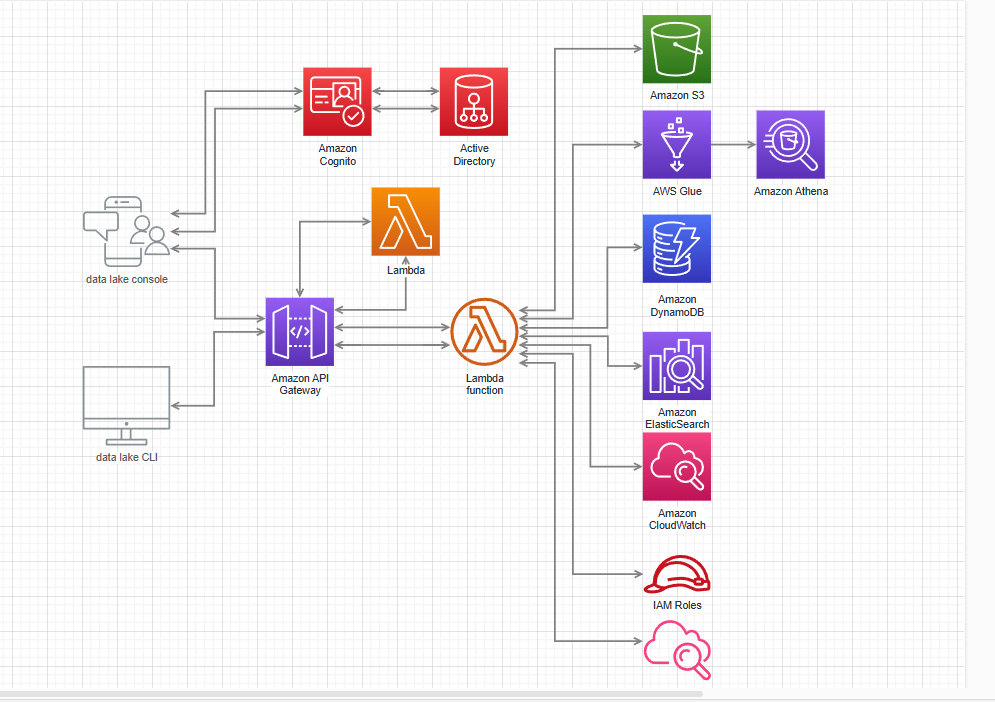

# serverless-DataLake-AWS
a serverless data lake architecture built on AWS services


# AWS Serverless Data Lake with API Gateway, Lambda & S3

##  Project Overview
This project implements a **fully serverless data lake** architecture on AWS. It is designed for efficient data ingestion, transformation, and querying using **API Gateway, Lambda, S3, DynamoDB, OpenSearch, Athena, and Glue**.

##  Key Features
- **API Gateway** to expose RESTful API endpoints.
- **AWS Lambda** for event-driven data processing.
- **Amazon S3** for data storage.
- **AWS Glue** for metadata cataloging.
- **Amazon Athena** for SQL-based querying.
- **Amazon DynamoDB** for NoSQL storage.
- **Amazon OpenSearch** for full-text search and indexing.
- **Amazon CloudWatch** for monitoring and logging.
- **IAM Roles & Cognito** for authentication and access control.

##  Architecture



## 📂 Project Structure
```plaintext
├── terraform/                  # Infrastructure as Code (Terraform)
│   ├── main.tf                 # AWS resource definitions
│   ├── variables.tf             # Variables for configuration
│   ├── outputs.tf               # Output values
│   ├── providers.tf             # AWS provider configuration
├── lambdas/                    # Lambda function code
│   ├── ingest_data.py           # Lambda function to process incoming data
│   ├── query_data.py            # Lambda function for querying data
│   ├── index_data.py            # Lambda function to index data in OpenSearch
├── scripts/                     # Helper scripts
│   ├── deploy.sh                # Script to deploy infrastructure
│   ├── cleanup.sh               # Script to remove all resources
├── README.md                    # Project documentation
```

## 🛠️ Setup & Deployment
### 1️⃣ Prerequisites
- **AWS Account** with permissions for IAM, Lambda, S3, API Gateway, and DynamoDB.
- **Terraform installed** (v1.5+ recommended).
- **AWS CLI configured** with necessary access credentials.

### 2️⃣ Deployment Steps
#### **Step 1: Clone the Repository**
```bash
git clone https://github.com/your-github/aws-data-lake.git
cd aws-data-lake
```

#### **Step 2: Deploy with Terraform**
```bash
cd terraform
terraform init
terraform apply -auto-approve
```

#### **Step 3: Deploy Lambda Functions**
```bash
cd lambdas
zip -r ingest_data.zip ingest_data.py
aws lambda create-function --function-name ingestData \  
    --runtime python3.9 --role <IAM_ROLE_ARN> --handler ingest_data.lambda_handler \
    --zip-file fileb://ingest_data.zip
```

#### **Step 4: Test the API Gateway Endpoint**
```bash
curl -X POST https://your-api-gateway-id.execute-api.us-east-1.amazonaws.com/prod/ingest \
    -H "Content-Type: application/json" -d '{"message": "Hello, World!"}'
```
File Structure
Copy├── index_data.py       # Lambda function to index data in OpenSearch
├── scripts/
│   ├── deploy.sh       # Script to deploy infrastructure
│   └── cleanup.sh      # Script to remove all resources
├── README.md           # Project documentation
└── requirements.txt    # Python dependencies
Getting Started
Prerequisites

AWS CLI configured with appropriate permissions
Python 3.9 or higher
Required Python packages (see requirements.txt)

Deployment

Create a requirements.txt file with the following dependencies:

Copyboto3>=1.26.0
pandas>=1.5.0
pyarrow>=8.0.0  # For Parquet support
opensearch-py>=2.0.0
requests_aws4auth>=1.1.0

Run the deployment script to set up the infrastructure:

bashCopy./scripts/deploy.sh [environment]
Where [environment] is optional and defaults to dev.
This script will:

Create an S3 bucket with appropriate folder structure
Create an IAM role for Lambda execution
Deploy the Lambda function
Create an OpenSearch domain
Set up S3 event triggers
Create a CloudWatch dashboard for monitoring

Cleanup
To remove all resources created by the deployment:
bashCopy./scripts/cleanup.sh [environment]
Usage
Data Organization
The data lake follows a three-tier structure:

Raw Zone (/raw): Original, immutable data as received
Processed Zone (/processed): Cleaned, validated, and transformed data
Curated Zone (/curated): Business-ready, enriched datasets

Uploading Data
Upload data files to the raw zone of the S3 bucket:
bashCopyaws s3 cp your-data-file.csv s3://data-lake-{environment}-xxxx/raw/dataset-name/
Searching Data
Once indexed, data can be searched using the OpenSearch API:
bashCopy# Get the domain endpoint from AWS console or using AWS CLI
ENDPOINT=$(aws opensearch describe-domain --domain-name data-lake-search-dev --query 'DomainStatus.Endpoint' --output text)

# Example search query
curl -X GET "https://$ENDPOINT/dataset_name_dev/_search" \
  -H 'Content-Type: application/json' \
  -d '{"query": {"match_all": {}}}'
Customization
Lambda Function Configuration
The Lambda function (index_data.py) can be customized to handle different data formats or apply specific transformations. Update the function code and redeploy as needed.
OpenSearch Index Mappings
For more complex indexing needs, modify the create_index_if_not_exists function in index_data.py to define custom mappings for your data structure.
Monitoring
A CloudWatch dashboard is created during deployment for monitoring:

Lambda function metrics (invocations, errors, duration)
S3 bucket metrics (size, object count)

Access the dashboard in the CloudWatch console under "Dashboards" > "DataLakeDashboard-{environment}".
Security Considerations
The default deployment uses simplified security settings for demonstration. For production:

Restrict the OpenSearch domain access policy
Use VPC for Lambda and OpenSearch
Implement fine-grained IAM permissions
Enable encryption for data at rest and in transit


##  Monitoring & Logs
- Use **AWS CloudWatch Logs** to monitor Lambda executions.
- **CloudWatch Metrics** for API Gateway and Lambda performance.

## 📌 Future Enhancements
- Implement real-time streaming with **Kinesis**.
- Add **Machine Learning models** for data analytics.

## 📜 License
This project is licensed under the **MIT License**.

## 👨‍💻 Author
**ashis-88** - AWS DevOps Engineer & Freelancer

